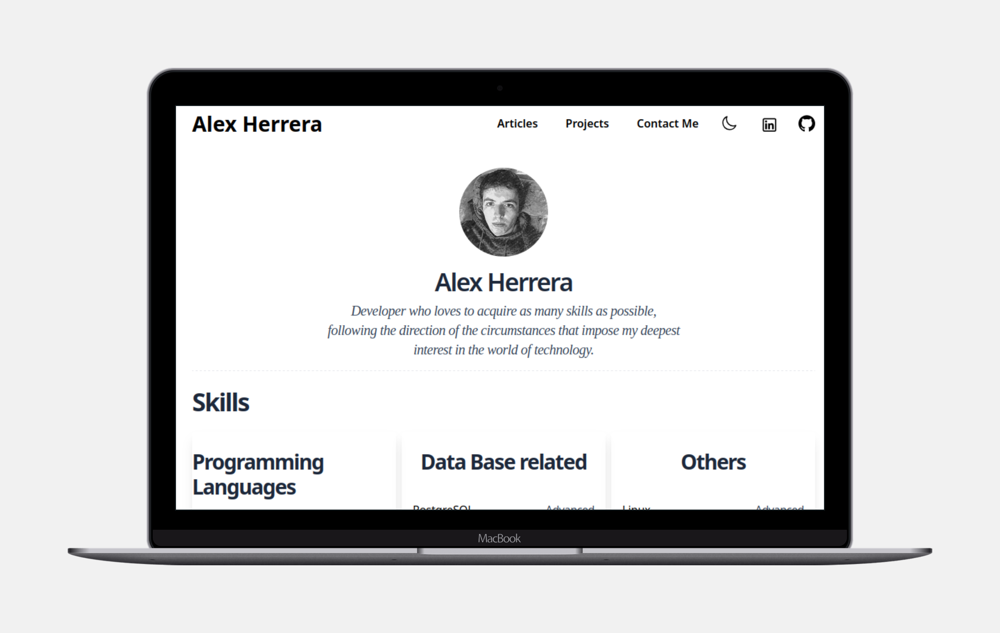

# Information

- This is the code of my personal site click [here](https://www.alexherrera.cl) to check it out

# What it does

This responsive portfolio website is a professional showcase of my work as a full-stack developer. It acts as a central hub where visitors can explore my projects, technical skills, and professional background. With a clean, minimalistic design, the site enables users to view detailed project descriptions, access source code for select projects, and connect with me via email or LinkedIn. It also highlights my programming expertise and provides access to my curriculum vitae.

# Why I built it

I developed this portfolio website to demonstrate my ability to create a polished, user-friendly web application from the ground up. It serves as a dynamic representation of my technical skills and passion for building impactful solutions. By designing and deploying this site, I aimed to provide a seamless way for potential employers and clients to understand my capabilities and get in touch.

# Tech Stack

- Front-End: Remix framework, React, TypeScript, Tailwind CSS for responsive styling
- Back-End: Neon, a serverless open-source PostgreSQL database
- Deployment: Hosted on Netlify with CI/CD integration via GitHub for streamlined deployments
- Version Control: Git, GitHub for source code management

# Screenshot



# Welcome to Remix!

- [Remix Docs](https://remix.run/docs)
- [Netlify Functions Overview](https://docs.netlify.com/functions/overview)

## Netlify Setup

1. Install the [Netlify CLI](https://docs.netlify.com/cli/get-started/):

```sh
npm i -g netlify-cli
```

If you have previously installed the Netlify CLI, you should update it to the latest version:

```sh
npm i -g netlify-cli@latest
```

2. Sign up and log in to Netlify:

```sh
netlify login
```

3. Create a new site:

```sh
netlify init
```

## Development

Ensure all packages are installed by running:

```sh
npm install
```

Run

```sh
netlify dev
```

Open up [http://localhost:8888](http://localhost:8888), and you're ready to go!

### Serve your site locally

To serve your site locally in a production-like environment, run

```sh
netlify serve
```

Your site will be available at [http://localhost:8888](http://localhost:8888). Note that it will not auto-reload when you make changes.

## Deployment

There are two ways to deploy your app to Netlify, you can either link your app to your git repo and have it auto deploy changes to Netlify, or you can deploy your app manually. If you've followed the setup instructions already, all you need to do is run this:

```sh
# preview deployment
netlify deploy --build

# production deployment
netlify deploy --build --prod
```
